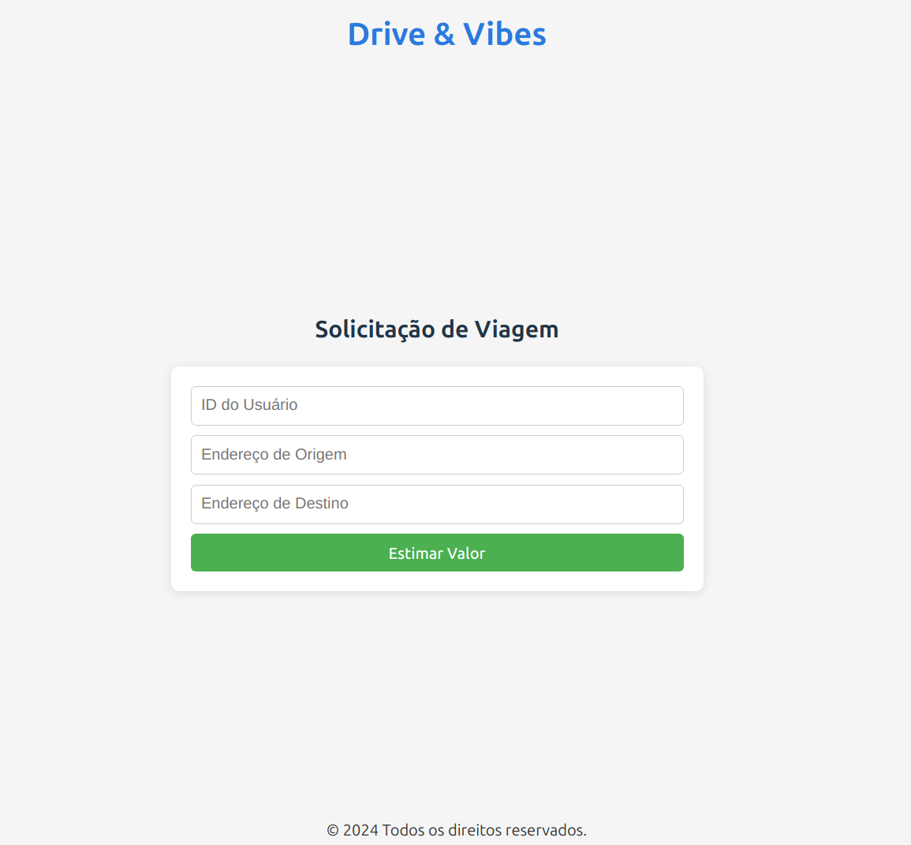
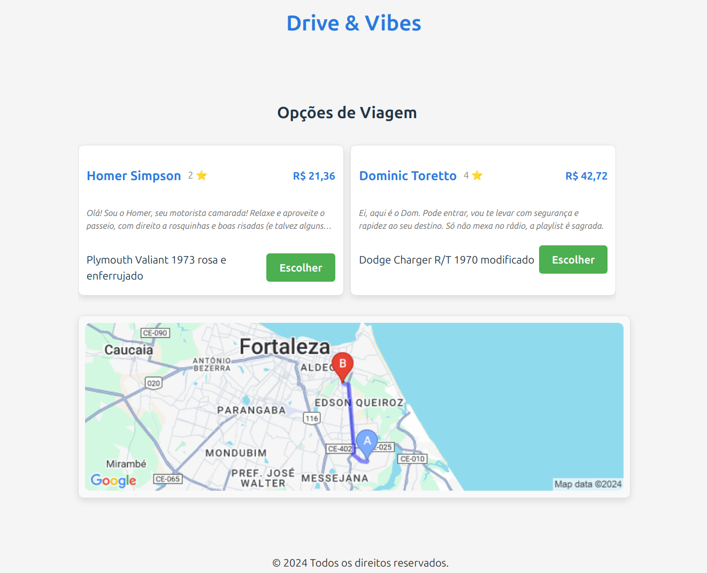
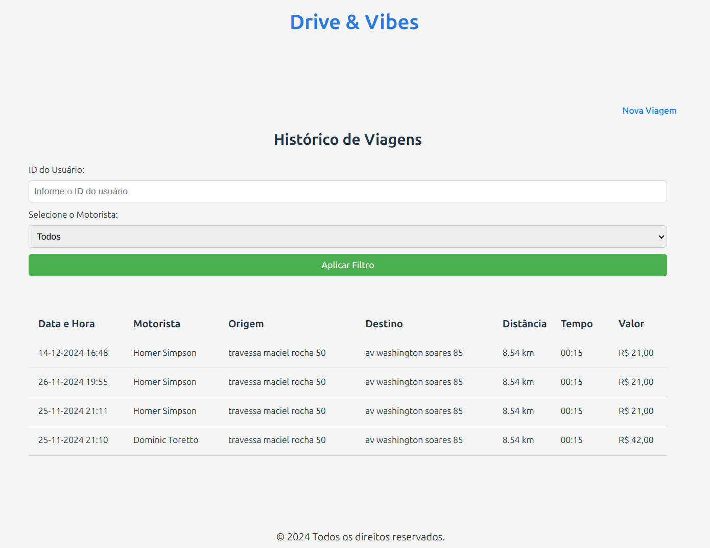
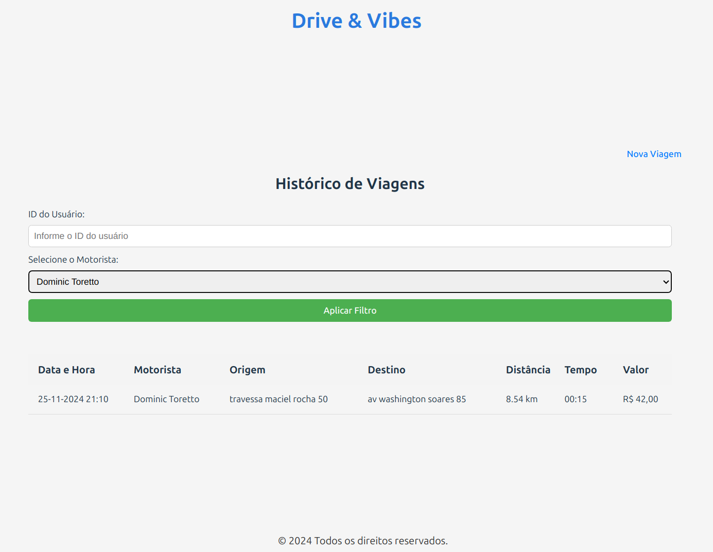

# Ride Sharing Concept Application

## Descrição do Projeto

Este é um aplicativo conceito de compartilhamento de viagens que permite aos usuários solicitar viagens particulares de um ponto A para um ponto B. Os principais recursos incluem:

- Estimativa de valores de viagem
- Seleção de motoristas disponíveis
- Confirmação de viagens
- Histórico de viagens






## Tecnologias Utilizadas

- **Backend**: 
  - NestJS
  - TypeScript
  - PostgreSQL

- **Frontend**:
  - React
  - Styled Components

- **Integração**:
  - Google Maps API

## Endpoints da API

### Estimativa de Viagem
- **POST** `/ride/estimate`
  - Recebe origem e destino
  - Calcula os valores da viagem

### Confirmação de Viagem
- **PATCH** `/ride/confirm`
  - Confirma a viagem
  - Grava a viagem no histórico

### Histórico de Viagens
- **GET** `/ride/{customer_id}?driver_id={id do motorista}`
  - Lista viagens realizadas por um usuário
  - Permite filtrar por motorista específico

## Pré-requisitos

- Docker
- Node.js
- Chave de API do Google Maps

## Configuração e Instalação

1. Clone o repositório:
   ```bash
   git clone https://github.com/elvesbd/shopper
   ```

2. Crie um arquivo `.env` na raiz do projeto com a chave da API do Google:
   ```
   GOOGLE_API_KEY=sua_chave_da_api_aqui
   ```

3. Inicie os serviços usando Docker Compose:
   ```bash
   docker-compose up
   ```

## Estrutura do Projeto

```
project-root/
│
├── backend/           # Código do NestJS
│   ├── src/
│   └── ...
│
├── frontend/          # Código do React
│   ├── src/
│   └── ...
│
├── .env               # Variáveis de ambiente
└── docker-compose.yml # Configuração do Docker
```

## Licença

MIT License